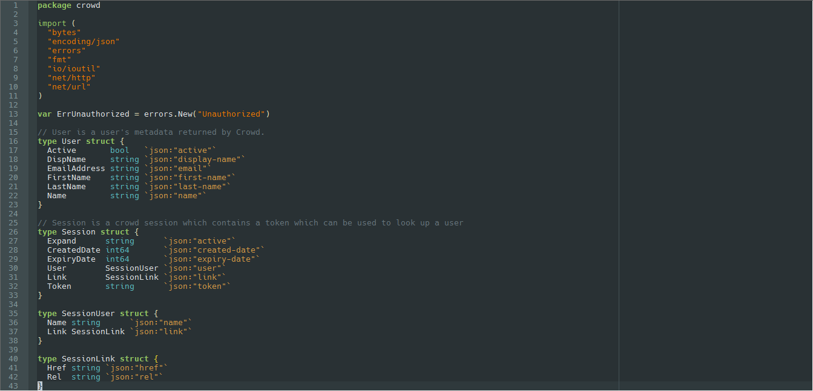

### Go-Obsidian
Dark Obsidian theme for Go-lang based on [Guomindang's config](https://www.reddit.com/r/golang/comments/3vgrwn/go_syntax_highlighting_and_builtin_function).

1. Copy content of  between `<NotepadPlus>` tags into your `userDefineLang.xml` file.
2. Copy  into your `plugins\APIs` directory.

